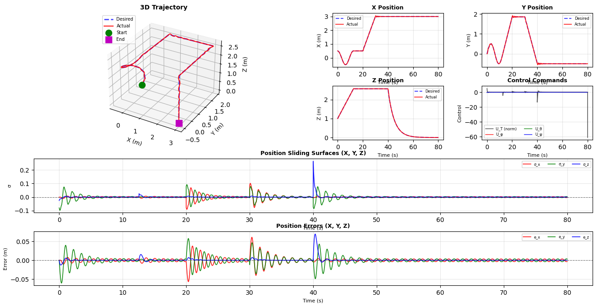
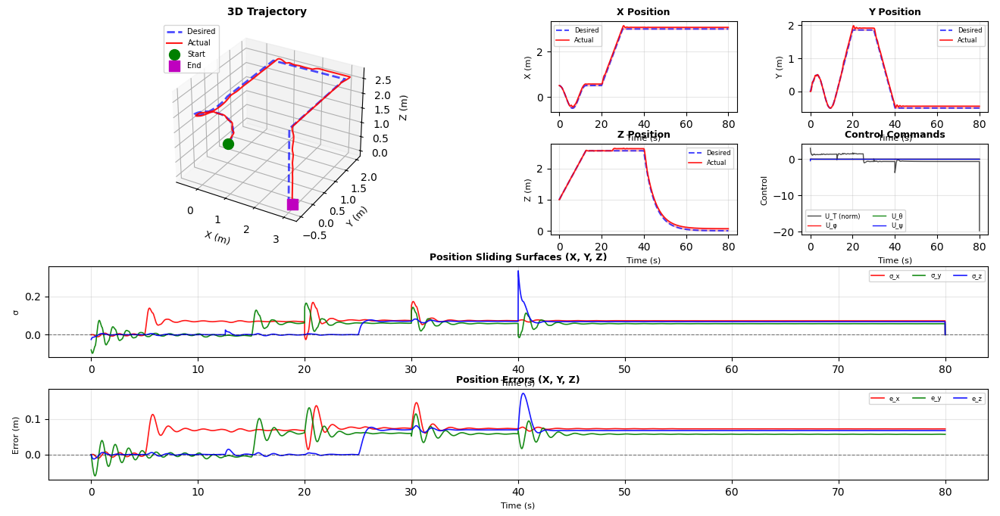
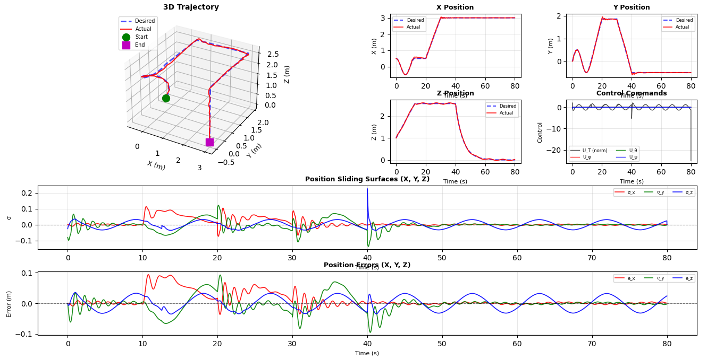
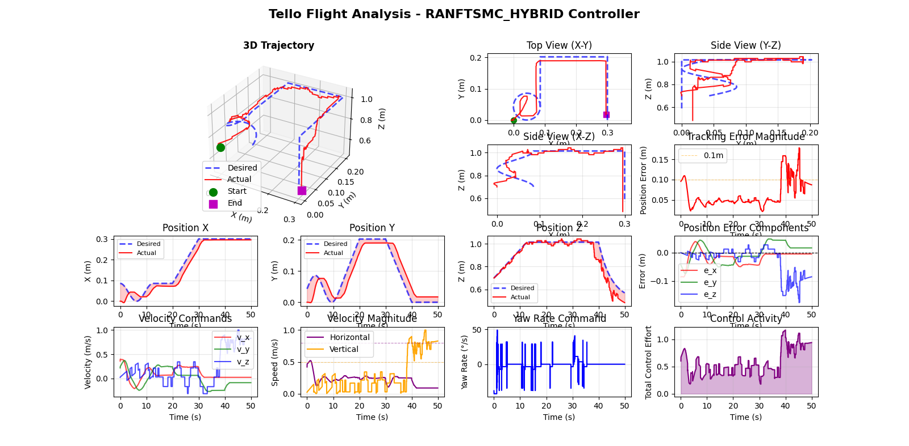

# Quadrotor RANFTSMC Control System

**Robust Adaptive Nonsingular Fast Terminal Sliding Mode Control for Quadrotor UAV Trajectory Tracking**

A comprehensive implementation of the RANFTSMC algorithm from Labbadi & Cherkaoui (ISA Transactions, 2020) for robust quadrotor control under uncertainties and external disturbances. This repository contains Python simulations and hardware experimental validation on DJI Tello.

---

## Table of Contents

- [Overview](#overview)
- [Part 1: Python Simulation](#part-1-python-simulation)
  - [Simulation Features](#simulation-features)
  - [Simulation Installation](#simulation-installation)
  - [Simulation Usage](#simulation-usage)
  - [Simulation Results](#simulation-results)
- [Part 2: Hardware Implementation](#part-2-hardware-implementation)
  - [Hardware Features](#hardware-features)
  - [Hardware Installation](#hardware-installation)
  - [Hardware Usage](#hardware-usage)
  - [Hardware Results](#hardware-results)
- [Citation](#citation)

---

## Overview

This project implements a **Robust Adaptive Nonsingular Fast Terminal Sliding Mode Controller (RANFTSMC)** for quadrotor UAVs, addressing key challenges in autonomous flight:

- **Robustness** against external disturbances (wind gusts, aerodynamic effects)
- **Adaptation** to parameter uncertainties and unknown dynamics
- **Chattering elimination** through smooth approximation
- **Real-time implementation** on embedded hardware

The implementation progresses through two stages:
1. **Simulation**: Python-based validation with comprehensive scenario testing
2. **Hardware Testing**: Real quadrotor flights on DJI Tello

---

# Part 1: Python Simulation

## Simulation Features

- **Multiple Trajectory Types**: Figure-8, circular, square, complex multi-segment, space figure-8
- **Disturbance Models**: Constant, time-varying, aggressive (matching paper scenarios)
- **Performance Metrics**: ISE, RMSE, IAE, maximum error tracking
- **Comprehensive Visualization**: 3D trajectories, state tracking, error plots, control inputs
- **Adaptive Control**: Real-time parameter estimation with gain saturation
- **CLI Interface**: Easy scenario selection and parameter tuning

### Repository Structure - Simulation

```
Python Simulation/
├── main.py                     # Main simulation entry point
├── RANFTSMController.py        # RANFTSMC controller implementation
├── QuadrotorSimulator.py       # Quadrotor dynamics and simulation
├── Generators.py               # Trajectory and disturbance generators
├── Params.py                   # System and controller parameters
├── PerformanceMetrics.py       # Metric calculation (ISE, RMSE, etc.)
└── Plotter.py                  # Visualization utilities
```

---

## Simulation Installation

### Prerequisites

- **Python 3.8+**

### Setup

```bash
# Clone the repository
git clone https://github.com/Ghaith-Chamaa/Quadrotor-RANFTSMC-Control-System
cd Quadrotor-RANFTSMC-Control-System

# Install Python dependencies
pip install numpy matplotlib
```

---

## Simulation Usage

### Quick Start - Paper Scenarios

Run the predefined scenarios from the paper:

```bash
# Simulation 1: Square trajectory, no disturbances
python "Python Simulation/main.py" --scenario sim1 --verbose

# Simulation 2: Circular trajectory, constant disturbances  
python "Python Simulation/main.py" --scenario sim2 --verbose

# Simulation 3: Complex trajectory, time-varying disturbances
python "Python Simulation/main.py" --scenario sim3 --verbose

# Simulation 5: Space figure-8, aggressive disturbances
python "Python Simulation/main.py" --scenario sim5 --verbose
```

### Custom Configuration

```bash
# Custom trajectory with specific initial conditions
python "Python Simulation/main.py" \
    --trajectory circle \
    --disturbance time_varying \
    --initial "0.5,0,1.0,0,0,0.2" \
    --time 60 \
    --dt 0.01 \
    --verbose \
    --save my_experiment.png
```

### Available Options

| Argument | Choices | Description |
|----------|---------|-------------|
| `--scenario` | sim1, sim2, sim3, sim5 | Paper simulation scenarios |
| `--trajectory` | 8, circle, square, complex, space8 | Trajectory shape |
| `--disturbance` | none, constant, time_varying, aggressive | Disturbance type |
| `--initial` | "x,y,z,φ,θ,ψ" | Initial conditions (comma-separated) |
| `--time` | float | Simulation duration (seconds) |
| `--dt` | float | Time step for RK approximation (default: 0.01s) |
| `--verbose` | flag | Detailed output and metrics |
| `--save` | filename | Save plots to file |

---

## Simulation Results

### Visualization

The following result is after executing:
```bash
python main.py --trajectory complex --disturbance none
``` 

<p align="center">
  <br>
  <em>Figure 1: 3D Trajectory Simulation without disturbance</em>
</p>

The following result is after executing:
```bash
python main.py --trajectory complex --disturbance constant
``` 

<br>

<p align="center">
  <br>
  <em>Figure 2: 3D Trajectory Simulation with constant disturbance</em>
</p>

The following result is after executing:
```bash
python main.py --trajectory complex --disturbance time_varying
``` 

<p align="center">
  <br>
  <em>Figure 3: 3D Trajectory Simulation with time varying disturbance</em>
</p>

### Performance Metrics

The simulation framework calculates comprehensive metrics matching the paper's ISE Table 4 in addition to:

- **ISE** (Integral Square Error)
- **RMSE** (Root Mean Square Error)
- **IAE** (Integral Absolute Error)
- **Maximum Absolute Error**

Example output:
```
PERFORMANCE METRICS (ISA Transactions Format)
============================================================
Integral Square Error (ISE) - Table 4:
  Position:
    x:     0.0234
    y:     0.0189
    z:     3.2e-05
  Attitude:
    φ:     0.0123
    θ:     0.0098
    ψ:     0.0156

Root Mean Square Error (RMSE):
  Position:
    x:     0.0456 m
    y:     0.0389 m
    z:     0.0012 m
  Attitude:
    φ:     0.0234 rad (1.34°)
    θ:     0.0198 rad (1.13°)
    ψ:     0.0289 rad (1.66°)
```

---

# Part 2: Hardware Implementation

## Hardware Features

- **Platform**: DJI Ryze Tello drone
- **Control Architecture**: Axis-specific RANFTSMC with independent parameter tuning
- **Key Capabilities**:
  - Direct velocity commands with body-to-world frame transformations
  - Dead reckoning position estimation with barometer fusion
  - Real-time trajectory tracking with configurable workspace bounds
  - Comprehensive flight data logging and analysis tools
  - Safety limits and emergency stop functionality

### Repository Structure - Hardware

```
DJI Tello Hardware Experiment/
├── main.py                     # Flight control entry point
├── Controller.py               # Axis-specific RANFTSMC controller
├── TelloInterface.py           # Hardware interface and state estimation
├── Trajectory.py               # Workspace-bounded trajectory generators
├── Params.py                   # Hardware-tuned parameters
├── PerformanceMetrics.py       # Flight metrics calculation
└── analyze_flight.py           # Post-flight data analysis tool
```

---

## Hardware Installation

### Prerequisites

- **Python 3.8+**
- **DJI Ryze Tello drone**

### Setup

```bash
# Install additional dependencies for Tello
pip install djitellopy

# Ensure Tello is charged and powered on
# Connect to Tello WiFi network (TELLO-XXXXXX)
```

---

## Hardware Usage

### Quick Start

```bash
# Connect to Tello WiFi first, then run:

# Hovering trajectory (safe for first flight)
python "DJI Tello Hardware Experiment/main.py" \
    --trajectory hover \
    --duration 20 \
    --debug

# Circular trajectory with small workspace
python "DJI Tello Hardware Experiment/main.py" \
    --trajectory circle \
    --workspace-size 0.5 \
    --duration 30 \
    --save-data

# Complex trajectory (paper-based)
python "DJI Tello Hardware Experiment/main.py" \
    --trajectory complex \
    --workspace-size 0.8 \
    --duration 60 \
    --debug \
    --save-data
```

### Available Options

| Argument | Choices | Description |
|----------|---------|-------------|
| `--trajectory` | complex, hover, circle | Trajectory type |
| `--workspace-size` | 0.15-1.0 | Workspace cube size in meters |
| `--duration` | float | Flight duration (seconds) |
| `--debug` | flag | Enable debug output |
| `--save-data` | flag | Save flight data to .npz file |

### Post-Flight Analysis

After a flight with `--save-data`, analyze the results:

```bash
# Analyze flight data
python "DJI Tello Hardware Experiment/analyze_flight.py" \
    flight_data_hybrid_YYYYMMDD_HHMMSS.npz \
    --save analysis_results.png

# Statistics only (no plots)
python "DJI Tello Hardware Experiment/analyze_flight.py" \
    flight_data_hybrid_YYYYMMDD_HHMMSS.npz \
    --no-plot
```

### Safety Guidelines

**Important Safety Notes:**
- Always fly in an open, indoor space away from obstacles
- Maintain visual line of sight with the drone
- Keep workspace-size ≤ 0.8m for confined spaces
- Monitor battery levels (lands automatically at 15%)
- Have emergency stop ready (Ctrl+C)
- Test with `hover` trajectory first

---

## Hardware Results

> **Note**: The current hardware results and controller parameters are optimized for **workspace-size = 0.3** (30% of paper's trajectory). These parameters provide stable tracking performance for small-scale indoor flights. For larger workspaces, parameter tuning is required.

The following result is after executing:
```bash
python main.py workspace_size 0.3 and duration 50
``` 

### Video Demonstrations


https://github.com/user-attachments/assets/74f13c21-2804-4252-9da2-2fbcdde069a2
<p align="center">
  <em>Test Flight</em>
</p>

### Visualization

<p align="center">
  <br>
  <em>Figure 3: desired vs actual path (workspace-size=0.3)</em>
</p>


### Key Hardware Results (workspace-size = 0.3)

The DJI Tello implementation demonstrates:

- **Position Tracking**: RMSE < 0.15m in XY, < 0.08m in Z
- **Control Rate**: 80 Hz
- **Workspace Scaling**: Tested at 0.3 X paper's scale(3m³) $\approx$ 1m³ volume
- **Safety**: Comprehensive bounds checking and emergency stop

Example flight statistics:
```
FLIGHT STATISTICS
======================================================================
Flight Duration: 45.23 seconds
Data Points: 906
Average Sample Rate: 80.0 Hz
Workspace Size: 0.3

Performance Metrics:
  RMSE (Root Mean Square Error):
    X: 0.1234 m
    Y: 0.0987 m
    Z: 0.0654 m

  Maximum Error:
    X: 0.2345 m
    Y: 0.1987 m
    Z: 0.1234 m

✓ All safety limits respected
```

---

## Citation

If you use this code in your research, please cite the original paper:

```bibtex
@article{labbadi2020robust,
  title={Robust adaptive nonsingular fast terminal sliding-mode tracking control for an uncertain quadrotor UAV subjected to disturbances},
  author={Labbadi, Moussa and Cherkaoui, Mohamed},
  journal={ISA transactions},
  volume={99},
  pages={290--304},
  year={2020},
  publisher={Elsevier}
}
```

**Reference**: Labbadi, M., & Cherkaoui, M. (2020). Robust adaptive nonsingular fast terminal sliding-mode tracking control for an uncertain quadrotor UAV subjected to disturbances. *ISA Transactions*, 99, 290-304.
